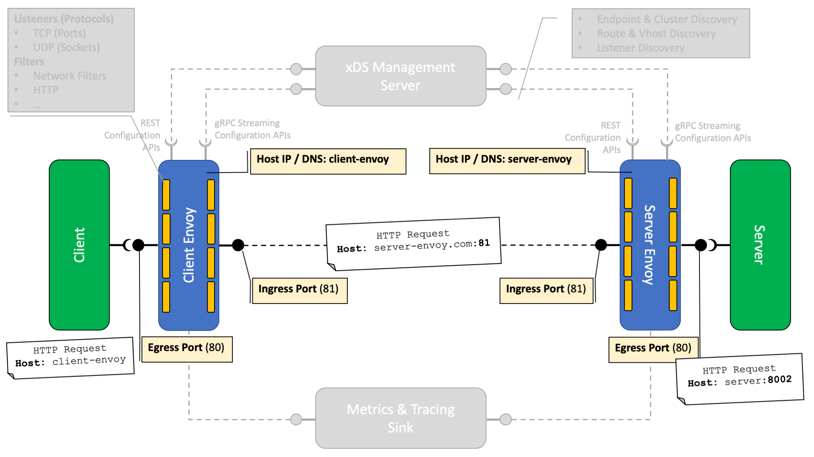

# Envoy-Testbed

This branch shows a more elaborate sample of using Envoy to create a (very basic) service mesh.

The setup includes a two Spring Boot applications - `client` and `server` - that communicate with each other.
Both applications are behind a dedicated Envoy instance - much like is the case in an Istio.io service mesh.  
When the applications communicate with each other, they do so via their respective Envoy proxies.

The respective Envoy proxies are configured using static `envoy.yaml` configuration files.  
In these configurations, each Envoy proxy exposes an _ingress_ listener port (`http_ingress`) - used for communication from the remote to the local (i.e. proxied) Spring Boot application. Likewise, each Envoy proxy exposes an _egress_ listener port (`http_egress`) that is used by the proxied Spring Boot application to communicate with the remote application on the outside.

Both `client` and `server` Spring Boot applications provide the following REST endpoints:
* `/send/{message}` - endpoint used from a browser to make `client` or `server` send a message to its counterpart.
* `/echo/{message}` - endpoint used by `client` or `server` to send the message to its counterpart. The respective endpoint implementation will echo back the received message prefixed with `Client says: ` and `Server says: ` respectively to be able to distinguish who responded.

In the their containers, `client` runs and listens on port `8001`, `server` on port `8002`. These ports are also exposed via Docker, so you could call them from the browser directly.

# Project Structure

```shell
startLandscape.sh # script to start all components using docker-compose
stopLandscape.sh  # script to stop and remove all components using docker-compose
- client          # client application components
  | docker-compose.yaml
  |- application  # client Spring Boot application
  |- envoy        # client Envoy proxy
- server          # server application components
  | docker-compose.yaml
  |- application  # server Spring Boot application 
  |- envoy        # server Envoy proxy
```

Both Spring Boot applications are built using Maven and generate a Docker image named `sap.com/client:1.0.0-SNAPSHOT` and `sap.com/server:1.0.0-SNAPSHOT` respectively.

Both `client` and `server` contain a separate `docker-compose.yaml` file to bring up the Spring Boot application and Envoy proxy sidecar. 

❗Note: To run the sample, you need to start **all four compontents** (i.e. client application & proxy and server application & proxy) as a single `docker-compose` project. This is to make sure that all components are attached to the same (Docker-generated) network and are able to address each other. See `startLandscape.sh` for an example of how to do that.

# Running the Sample

To run the sample, you need Docker installed. Execute the following steps to get things going:

1. `mvn clean package -f client/application/pom.xml` - build the client.
2. `mvn clean package -f server/application/pom.xml` - build the server.
3. `startLandscape.sh` - build the Docker images and start all containers (of server and client).
4. `docker container ls` - to confirm that the containers are up and running

This will start the following containers:
* `client` - hosting the Spring Boot application of the client.
* `client-envoy` - hosting the Envoy proxy of the client application.
* `server` - hosting the Spring Boot application of the server.
* `server-envoy` - hosting the Envoy proxy of the server.

Once up and running, you can test the setup by doing the following:
1. Using your browser, send request to `http://localhost:81/send/HelloWorld`. 
   This sends a request to the ingress port (81) of the `client-envoy` proxy.
   The proxy will forward the request to its downward `client` application on port `8001`.
   The application will send a request to the `server`'s `/echo/{message}` endpoint via its own `client-envoy` proxy.
2. As a result, you should see `Server says: HelloWorld`.

Note: you could also call `http://localhost:8001/send/HelloWorld` directly, thus bypassing the `client-envoy` ingress and communicating directly with the `client` application's `/send/{message}` endpoint.

To shut down the sample, use:
1. `stopLandscape.sh`
2. `docker container ls` - to confirm that the containers are gone.

❗Note: whenever you make changes to any of the `envoy.yaml` files you need to rebuild the Docker images using `docker-compose build`. The `startLandscape.sh` script makes sure this always happens.

# Explanation of the Setup

When you execute `startLandscape.sh` the following containers will be started:
* `client`
* `client-envoy`
* `server`
* `server-envoy`

These containers are joined to the same network, and hence can address each other by their container name!
This is a Docker feature and makes building up a network of containers easy. All containers need to be part of the same docker-compose project however (see `startLandscape.sh` to see how this can be made sure of, even though `client` and `server` have two different `docker-compose.yaml` files.)

The setup of the containers is as shown below:



The `client` application runs on port 8002 inside the Docker container.  
Envoy `client-envoy` exposes two ports: 
- port 80 is the egress port, which is used by the client application to communicate outbound.
- port 81 is the ingress port, which remote applications use to call into the `client` application via its proxy.

Likewise the same setup is chosen for the server-side.

Whenever, `client` communicates outbound, it simply sends requests to `http://client-envoy` and `client-envoy` will proxy the request on to the `echo-server-cluster` which points to the address of `server-envoy:81`.
Optionally, (currently not implemented), the `client` application can set a different `Host` header, based on which `client-envoy` could select the server cluster to send the outgoing request to. This selection is then done based on matching the `Host` header value against the `virtual_hosts` configured in `client-envoy`'s `envoy.yaml`.


# References

* [Envoy Documentation by Version](https://www.envoyproxy.io/docs)
* [Envoy Latest Documentation](https://www.envoyproxy.io/docs/envoy/latest/)
* [Getting Started](https://www.envoyproxy.io/docs/envoy/latest/start/start)
* [Envoy Dynamic Configurations](https://www.envoyproxy.io/docs/envoy/latest/intro/arch_overview/operations/dynamic_configuration#arch-overview-dynamic-config)
* [Envoy Configuration Sources](https://www.envoyproxy.io/docs/envoy/latest/api-v2/api/v2/core/config_source.proto#envoy-api-field-core-configsource-api-config-source)
* [Envoy xDS Management Server API Definitions](https://www.envoyproxy.io/docs/envoy/latest/configuration/overview/xds_api#config-overview-management-server)
* [Envoy xDS Management Server API Reference Implementation - Java](https://github.com/envoyproxy/java-control-plane)
* [Envoy xDS Management Server API Reference Implementation - Go](https://github.com/envoyproxy/go-control-plane)
* [Envoy HTTP Connection Manager Filter](https://www.envoyproxy.io/docs/envoy/latest/api-v3/extensions/filters/network/http_connection_manager/v3/http_connection_manager.proto#envoy-v3-api-msg-extensions-filters-network-http-connection-manager-v3-httpconnectionmanager)
* [Envoy Deployment Types (Ingress, Egress, FrontProxy)](https://www.envoyproxy.io/docs/envoy/latest/intro/deployment_types/deployment_types)
* [Envoy Ciruit Breaking](https://www.envoyproxy.io/docs/envoy/latest/intro/arch_overview/upstream/circuit_breaking#arch-overview-circuit-break)
* [Envoy Network Filters (Reference)](https://www.envoyproxy.io/docs/envoy/latest/configuration/listeners/network_filters/network_filters)
* [Envoy HTTP Filters(Reference)](https://www.envoyproxy.io/docs/envoy/latest/configuration/http/http_filters/http_filters)
